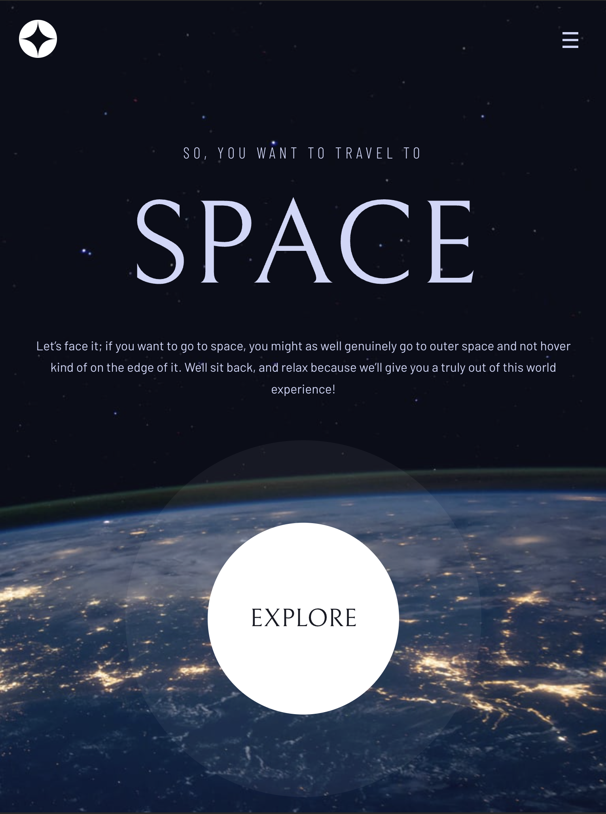

# Space travel for everyone

 

A project from [Frontend Mentor](https://www.frontendmentor.io/challenges/space-tourism-multipage-website-gRWj1URZ3) to build a responsive website for a space travel company. 
The website has 4 pages: home, destinations, crew and technology. 
Most pages are equipped with slider animation using Vanilla JavaScript. 

## 🎉 Features:
- 100% pixel perfect
- Use of data.json file to store and retrieve data
- Use of JavaScript for the hamburger menu
- Use of JavaScript for slider animation
- Responsive design for all devices
- Hover and focus states for all interactive elements on the website

##   Build with:
- HTML5 (Semantic HTML, BEM methodology, SEO, Accessibility)
- JavaScript (DOM manipulation, Event handling, Fetch API)
- CSS (Grid, Flexbox, Animations, Responsive design)